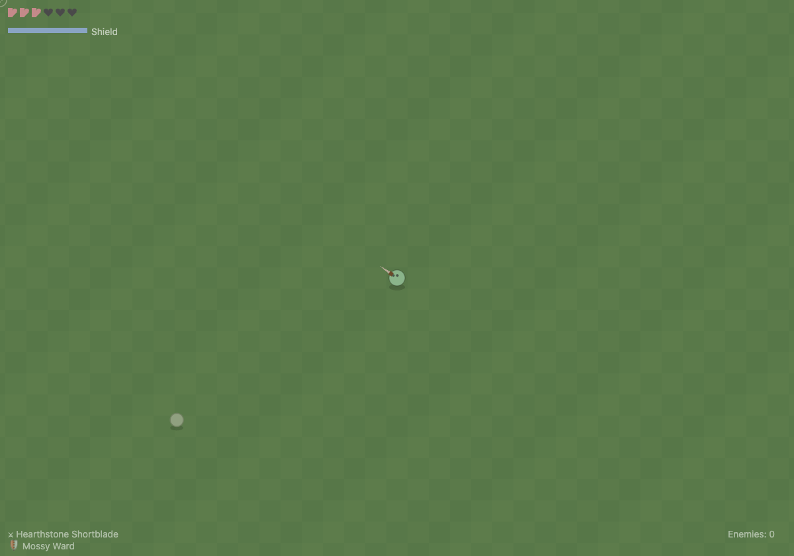

# cozylike

A top-down action roguelite — no build step, no framework, no external assets. Just a canvas, a game loop, and a lot of procedural variance.

Almost entirely generated in one shot from [spec.md](spec.md) using [Qwen3.6-35B-A3B](https://huggingface.co/unsloth/Qwen3.6-35B-A3B-GGUF?show_file_info=Qwen3.6-35B-A3B-UD-Q2_K_XL.gguf) (~2 bit). on Nvidia RTX 4080 with 16GB VRAM in about ~20min.



## Features

- **Procedural worlds** — 120×90 tile maps generated with cellular automata smoothing on value noise. Every run is different.
- **Equipment system** — swap swords and shields. Ground items compare stats on hover, click to swap. You always have both slots filled.
- **Enemy traits** — randomized speed, damage, HP, aggression radius, leap-attack chance, and shield reaction. Visual hints (shape, color) emerge from the trait roll.
- **Shield mechanics** — raise with right-click, drain stamina, break at zero with cooldown. On-block effects (slow, paralyze, reflect) proc randomly.
- **Combat feel** — hitstun, pushback, knockback, crit feedback, lifesteal particles, lerp camera, DPR-aware canvas rendering.
- **Cozy aesthetic** — warm muted palette, rounded silhouettes, breathing idle bob, procedural tile variation, soft reticle. No blood.

## How to run

```bash
./run.sh --port 8000        # idempotent: creates .venv, installs deps, starts server
```

Then open `http://127.0.0.1:8000/`. The game drops straight into a fresh world — no menu, no loading screen.

### Prerequisites

- Python 3.11+
- `uv` (for venv + pip)

### Manual start

```bash
uv venv .venv
uv pip install -r requirements.txt --python .venv/bin/python
uv run src/server.py --port 8000
```

## Controls

| Input | Action |
|---|---|
| `WASD` | Move 8-directionally |
| Mouse | Aim — player faces cursor |
| Left click | Sword attack — hitbox in aim direction |
| Right click (hold) | Raise shield — blocks frontal arc, drains stamina |
| `Shift` | Dash — 120px over 180ms with i-frames; direction follows WASD or aim |

Mouse cursor is hidden over the canvas; a soft circular reticle is drawn instead.

## Architecture

FastAPI serves `static/` at `http://127.0.0.1:8000/static/`. The browser loads ES modules directly — no bundler.

```
src/server.py          — FastAPI app; serves index.html at /, static/ at /static/
static/index.html      — single <canvas> + one ESM script entry point
static/js/main.js      — game loop (fixed 60 FPS accumulator), shared `game` state
static/js/world.js     — cellular automata generation, tile helpers
static/js/player.js    — movement, combat, shield, dash
static/js/enemies.js   — trait-based AI, spawning, drop table
static/js/items.js     — affix generation, ground pickups, swap UI
static/js/render.js    — camera, tile/enemy/player/item rendering
static/js/ui.js        — HUD (hearts, stamina, kills, equipped items, tooltips)
```

`main.js` owns the single `game` state object. All modules receive references — no globals.

## Debugging

- `window.game` exposes full game state in the browser console.
- No error boundaries — a JS error crashes the game loop. Check the console.
- All rendering goes through `render.js`. If something isn't visible, check camera position and canvas dimensions.

## Known issues

See `AGENTS.md` for a living list of gotchas (dead code, duplicate functions, hardcoded constants).

## Support

If you find this interesting, consider [buying me a coffee](https://buymeacoffee.com/kibotu).  

## License

See [LICENSE](LICENSE) file.
